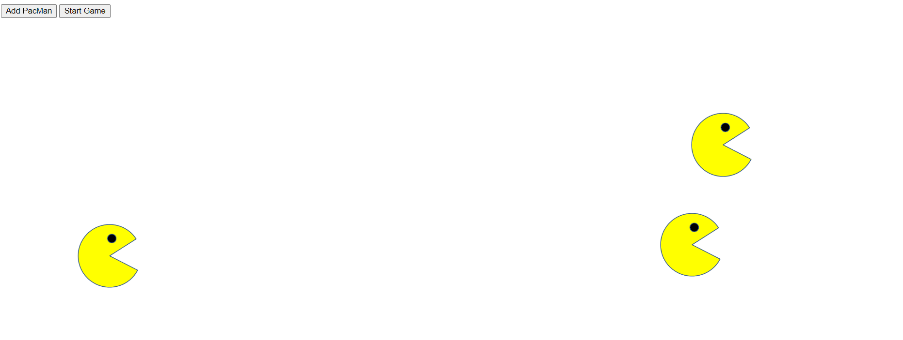

# PacMen-Exercise

<a href ="https://amohanty101.github.io/PacMen-Exercise"> Visit Site </a>

The task is to create a Pacman on demand (Add PacMan) and move these pacmen across the page.

Here's how the game is played:

When you click the "Add PacMan" button, a new pacman should appear at a random position on the screen.
When you click the "Start Game" button, the pacman or pacmen created should start moving at random velocity on the screen.
When a given pacman hits the edge of the screen, it should change position to stay within the frame of the web page.

How to Run: 

Fork repo to use these 3 starter files
- 4 PacMan images ( Mouth Open, Mouth Close, Left To Right, Right to Left )
- index.html file contains an id ='game' that gives a handle on the element 
- pacmen.js file contains js code to Implement the makePac() and checkCollisions() functions

Roadmap of future improvements:
- Intend to have a Pause button to pause the game
- When the pacman hits the collision, pacman should face the reverse direction

MIT License

Copyright (c) 2022 Anjali Mohanty

Permission is hereby granted, free of charge, to any person obtaining a copy
of this software and associated documentation files (the "Software"), to deal
in the Software without restriction, including without limitation the rights
to use, copy, modify, merge, publish, distribute, sublicense, and/or sell
copies of the Software, and to permit persons to whom the Software is
furnished to do so, subject to the following conditions:

The above copyright notice and this permission notice shall be included in all
copies or substantial portions of the Software.

THE SOFTWARE IS PROVIDED "AS IS", WITHOUT WARRANTY OF ANY KIND, EXPRESS OR
IMPLIED, INCLUDING BUT NOT LIMITED TO THE WARRANTIES OF MERCHANTABILITY,
FITNESS FOR A PARTICULAR PURPOSE AND NONINFRINGEMENT. IN NO EVENT SHALL THE
AUTHORS OR COPYRIGHT HOLDERS BE LIABLE FOR ANY CLAIM, DAMAGES OR OTHER
LIABILITY, WHETHER IN AN ACTION OF CONTRACT, TORT OR OTHERWISE, ARISING FROM,
OUT OF OR IN CONNECTION WITH THE SOFTWARE OR THE USE OR OTHER DEALINGS IN THE
SOFTWARE.
